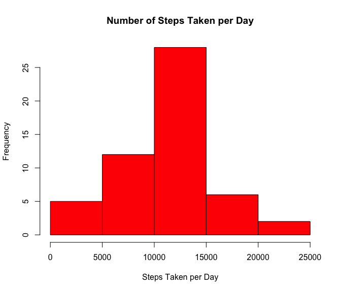
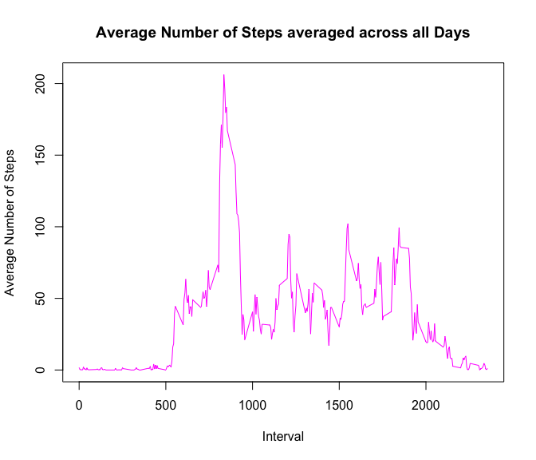
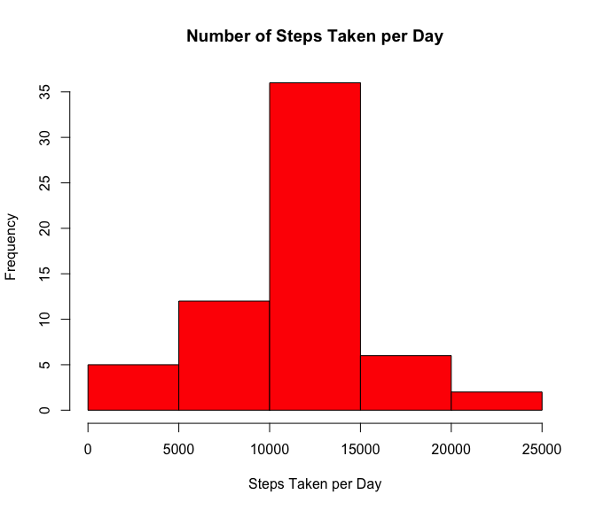
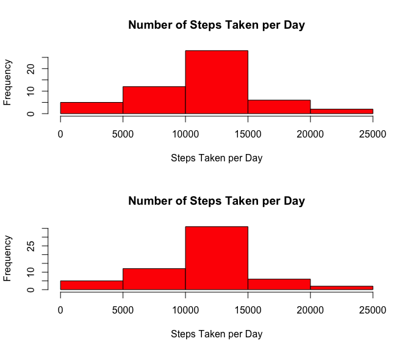
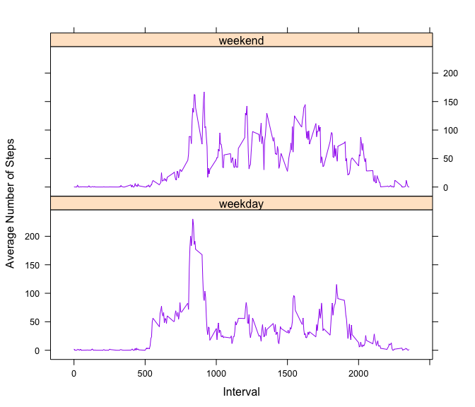

# Reproducible Research: Peer Assessment 1


## Loading and preprocessing the data
1. Load the data (i.e. `read.csv()`)

```r
unzip("activity.zip")
activitydata <- read.csv("activity.csv", header = TRUE, sep = ",")
```

2. Process/transform the data (if necessary) into a format suitable for your analysis

```r
activitydata$date <- as.Date(activitydata$date, format = "%Y-%m-%d")
```

## What is mean total number of steps taken per day?
1. Make a histogram of the total number of steps taken each day

```r
totalsteps <- aggregate(steps ~ date, data = activitydata, sum)
hist(totalsteps$steps, main = "Number of Steps Taken per Day", col = "red", xlab = "Steps Taken per Day")
```

<!-- -->

2. Calculate and report the **mean** and **median** total number of steps taken per day

```r
meansteps <- mean(totalsteps$steps)
meansteps
```

```
## [1] 10766.19
```

```r
med.steps <- median(totalsteps$steps)
med.steps
```

```
## [1] 10765
```

## What is the average daily activity pattern?
1. Make a time series plot (i.e. `type = "l"`) of the 5-minute interval (x-axis) and the average number of steps taken, averaged across all days (y-axis)

```r
step.interval <- aggregate(steps ~ interval, activitydata, mean)
plot(step.interval, type = "l", main = "Average Number of Steps averaged across all Days", xlab = "Interval", ylab = "Average Number of Steps", col = "magenta")
```

<!-- -->

2. Which 5-minute interval, on average across all the days in the dataset, contains the maximum number of steps?

```r
step.interval$interval[which.max(step.interval$steps)]
```

```
## [1] 835
```

## Imputing missing values
1. Calculate and report the total number of missing values in the dataset (i.e. the total number of rows with `NA`s)

```r
act.na <- sum(is.na(activitydata))
act.na
```

```
## [1] 2304
```

2. Devise a strategy for filling in all of the missing values in the dataset. 3. Create a new dataset that is equal to the original dataset but with the missing data filled in.

```r
activitydata.2 <- cbind(activitydata, step.interval$steps)
names(activitydata.2) <- c("steps", "date", "interval", "steps.avg")

for (i in 1:nrow(activitydata.2)) {
	if (is.na(activitydata.2$steps[i])) {
		activitydata.2$steps[i] <- activitydata.2$steps.avg[i]		
	}
}
activitydata.2 <- activitydata.2[,1:3]
```

4. Make a histogram of the total number of steps taken each day and Calculate and report the **mean** and **median** total number of steps taken per day. 

```r
totalsteps2 <- aggregate(steps ~ date, data = activitydata.2, sum)
hist(totalsteps2$steps, main = "Number of Steps Taken per Day", col = "red", xlab = "Steps Taken per Day")
```

<!-- -->

```r
meansteps2 <- mean(totalsteps2$steps)
meansteps2
```

```
## [1] 10766.19
```

```r
med.steps2 <- median(totalsteps2$steps)
med.steps2
```

```
## [1] 10766.19
```

Do these values differ from the estimates from the first part of the assignment? What is the impact of imputing missing data on the estimates of the total daily number of steps?
### The results of the mean remain the same while the median slightly differs

##To show both histogram plots in one window to compare

```r
par(mfrow = c(2,1))
hist(totalsteps$steps, main = "Number of Steps Taken per Day", col = "red", xlab = "Steps Taken per Day")
hist(totalsteps2$steps, main = "Number of Steps Taken per Day", col = "red", xlab = "Steps Taken per Day")
```

<!-- -->

## Are there differences in activity patterns between weekdays and weekends?
1. Create a new factor variable in the dataset with two levels -- "weekday" and "weekend" indicating whether a given date is a weekday or weekend day.

```r
date.type <- weekdays(activitydata.2$date)
date.typevec <- vector()
for (i in 1:nrow(activitydata.2)) {
	if (date.type[i] == "Saturday") {
		date.typevec[i] <- "weekend"
	} else if (date.type[i] == "Sunday") {
		date.typevec[i] <- "weekend"
	} else {
		date.typevec[i] <- "weekday"
	}
}
activitydata.2$date.type <- date.typevec
activitydata.2$date.type <- factor(activitydata.2$date.type)
```

2. Make a panel plot containing a time series plot (i.e. `type = "l"`) of the 5-minute interval (x-axis) and the average number of steps taken, averaged across all weekday days or weekend days (y-axis). 

```r
step.day <- aggregate(steps ~ interval + date.type, data = activitydata.2, mean)
library(lattice)
xyplot(steps ~ interval | date.type, step.day, type = "l", layout = c(1,2), xlab = "Interval", ylab = "Average Number of Steps", col = "purple")
```

<!-- -->

### There is a slight difference in activity patterns between weekdays and weekends
